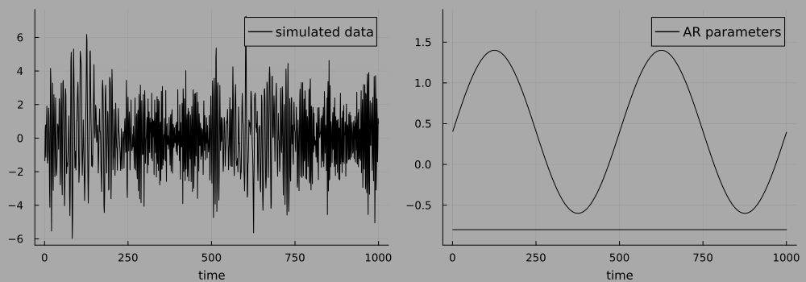
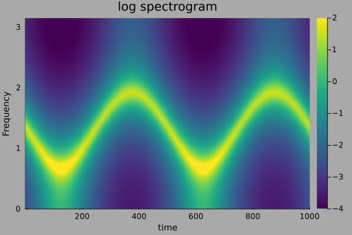
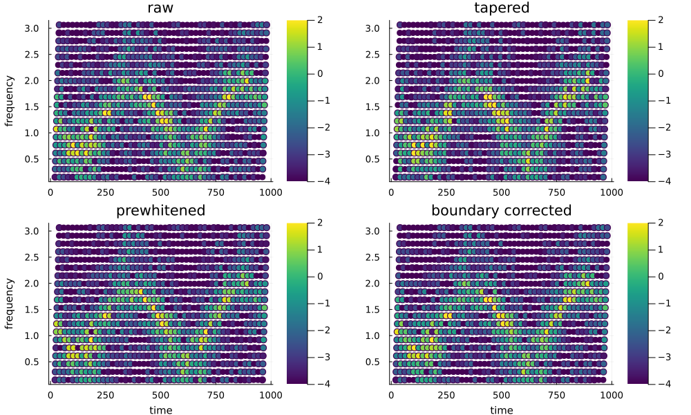
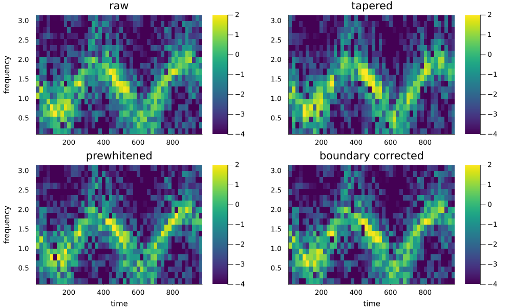
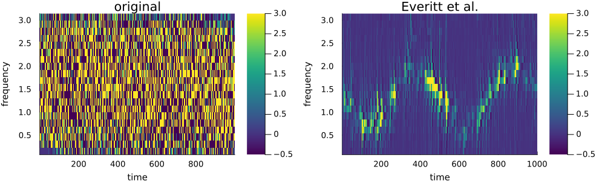

```@meta
CurrentModule = TimeVaryingPeriodograms
```

# TimeVaryingPeriodograms

Documentation for [TimeVaryingPeriodograms](https://github.com/OskarGU/TimeVaryingPeriodograms.jl).


This package is under development. It include several ways to compute a time-varying spectrograms that can be used as a part of inference for locally stationary time series models.

The package is currently used as a help package in multiple research projects.

# Example usage:

## Moving periodograms

```julia
using TimeVaryingPeriodograms, Plots, DSP, ProgressBars
gr(grid = true, legendfontsize=11, xtickfontsize=9, ytickfontsize=9, xguidefontsize=10, yguidefontsize=10,        
   titlefontsize=14, markersize=5, markerstrokecolor=:auto, background_color=:darkgrey, c=:viridis
)
```
We start by simulating a time-varying AR(2) model for illustration. We use 1000 observation and the first AR-coefficient evolves as:

$ \phi_{1,t} = sin\left(\frac{4πt}{T} \right) + 0.4, \quad \text{for }  t \in 1,\dots,1000 $


```julia
T = 1000; 
ϕ = [sin.(2π*(1:2:2T)/T).+0.4 -0.8*ones(T)]; 
θ = zeros(T); 
σ = 1; μ = 2;
y = simTvARMA(ϕ, θ, 0, σ);
py = plot(y, label="simulated data", c=:black, background_color=:grey, xlab=time)
pϕ = plot(ϕ[:,1], label="AR parameters", c=:black, background_color=:grey, xlab="time", ylim=(-0.99,1.9))
plot!(ϕ[:,2], c=:black, background_color=:grey,label=false)
plot(py,pϕ, size = (1000,350), bottom_margin=4Plots.mm, background_color=:grey)
```


The time-varying spectral density of the process is given by:



The moving periodogram data is given as a univariate time series of length $T-2m$, and the periodogram entity of the periodogram data belong to a single frequency, see Gustafsson, Villani, and Kohn (2024). 

The periodogram data is computed for all 4 adjustments using

```julia
m=30
MI, λ = mvPeriodogram(y, m, 1)
λr = repeat(λ*π, (T-2m)÷m + 1)
MIBC, λ  = BoundCorrectedMvPeriodogram(y, m, 2, 1)
MIPreW,λ = mvPrewhitePeriodogram(y, m, 2, 1)
MITap, λ = mvTapPeriodogram(y, m, 1, 1) 
```

And the log periodograms can then be plotted using:
```julia
scatterRaw  = scatter(m+1:T-m, λr, marker_z=log.(MI), label =false, title = "raw", ylab="frequency")
scatterBC   = scatter(m+1:T-m, λr, marker_z=log.(MIBC), label =false, title = "boundary corrected",lab="time")
scatterPreW = scatter(m+1:T-m, λr, marker_z=log.(MIPreW), label=false, title = "prewhitened", xlab="time" lab="frequency")
scatterTap  = scatter(m+1:T-m, λr, marker_z=log.(MITap),  label =false, title = "tapered")
plot(scatterRaw,scatterTap,scatterPreW,scatterBC, layout = (2,2), clim=(-4,2),
     size = (1000,600), left_margin=4Plots.mm, background_color=:darkgrey
)
```



one may notice that when we use this method we loose $m$ observations in the start and end of the series. 

## Block periodograms
Corresponding block periodograms data can be are created from 
```julia
N=2m+1
S=20
BW = tvPeriodogram(y, N, S)
tapBW = tvPeriodogram(y, N, S, nothing, hanning)
preWBW =  preWhiteTvBlockPeriodogram(y,N,S,2)
BCBW =  tapBoundCorrectTvBlockPeriodogram(y,N,S,2,nothing)
```

and the logs plotted as:
```julia
hBW   = heatmap(m+1:S:T-m, λ*π,  log.(BW[1][2:end,:]), title="raw", ylab="frequency")
hTap  = heatmap(m+1:S:T-m, λ*π,  log.(tapBW[1][2:end,:]), title = "tapered")
hPreW = heatmap(m+1:S:T-m, λ*π,  log.(preWBW'[2:end,:]),title="prewhitened", xlab="time", ylab="frequency")
hBC   = heatmap(m+1:S:T-m, λ*π,  log.(BCBW'[2:end,:]), title = "boundary corrected", xlab="time")
plot(hBW,hTap,hPreW,hBC, layout = (2,2), size = (1000,600), 
    left_margin=4Plots.mm, background_color=:darkgrey, clim=(-4,2)
)
```


Note the difference with the moving periodogram that here we instead get multivariate time series observations at roughly $T/S$ time points. We have the same problems as before that we loose some observationms at the edges.


## Preperiodograms
The preperiodograms can be computed to get maximal time-frequency resolution, however, the data is no longer approximately exponentially distributed. They also come with interfearing cross-terms which make them harder to use. The Everitt et al. version have two smoothing parameters $\rho$ and $\nu$ which controls smoothing over time and frequency. Below I work with the same number of frequencies as in the above periodograms, but we can have the full vector of Fourier frequencies here.

The preperiodograms can be computed as:
```julia
preP = prePeriodogram(y,λ*π)
everittPeriodogram = EverittI(y, λ*π , 0.4, 0.92)
```

and be plotted as:
```julia
hPreP = heatmap(1:T-1,λ*π, real(preP'), clim=(-1,2), title="original")
hEverit = heatmap(real(everittPeriodogram)', clim=(-0.1,0.4), title="Everitt et al.") 
plot(hPreP,hEverit, layout = (1,2), size = (1000,300), left_margin=4Plots.mm, 
     bottom_margin=4Plots.mm, background_color=:darkgrey, 
     xlab="time", ylab="frequency", clim=(-0.5,3)
)
```



Note that the plots are not in logs here since we also obtain negative values.


